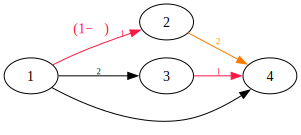
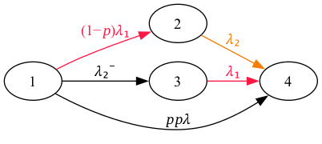

<a name="readme-top"></a>

[![pypi][pypi-shield]][pypi-url]
[![Contributors][contributors-shield]][contributors-url]
[![Forks][forks-shield]][forks-url]
[![Stargazers][stars-shield]][stars-url]
[![Issues][issues-shield]][issues-url]
[![MIT License][license-shield]][license-url]
[![LinkedIn][linkedin-shield]][linkedin-url]

# Markov Solver for Safety
> This package supports the Markov analysis used as safety substantiation presented in ARP4761A/ED-135.

Markov analysis is a powerful probabilistic tool used in safety assessments, particularly within the aerospace industry, to evaluate the reliability and safety of systems over time. According to the guidelines provided in ARP4761, a standard for safety assessment of civil airborne systems, Markov analysis is utilized to model and analyze systems that may experience multiple states and transitions, especially when system components may repair and return to service.

A Markov Chain represents a system as a series of states, each with a defined probability of transitioning to another state over a given time period. In the context of safety analysis, these states often represent various operational conditions of a system—ranging from fully operational to complete failure, including intermediate degraded states. The transition rates between these states are typically governed by failure rates, repair rates, or maintenance actions.

In safety-critical systems, understanding how a system transitions between states is crucial for evaluating its reliability and safety performance. Markov analysis provides a framework to calculate the likelihood of the system being in a particular state at a given time, which is essential for predicting system behavior under normal and failure conditions.

ARP4761 recommends Markov analysis for situations where system behaviors are too complex to be accurately modeled by simpler methods like Fault Tree Analysis (FTA) or Reliability Block Diagrams (RBDs). This complexity might arise due to dependencies between components, or the ability of the system to recover from certain failures.

## Installation

For installing Markov Solver for Safety, just run any of the following commands:

### Atica feature: Access API for Capella with Docker

```bash
docker build -t markov-app .
docker run --rm -p 5000:5000 markov-app
```

Test the API is working in localhost:5000/

### Basic installation

```bash
pip install markovsolver4safety
```

### Installation with drawing feature
```bash
pip install markovsolver4safety[drawing_feature]
```

## Usage example

### Basic Initialization

```py
>>> data = {
...     "State": ["1", "2", "3", "4"],
...     "Active Generator": ["Operating", "Failed", "Operating", "Failed"],
...     "Standby Generator": ["Standby", "Operating", "Failed", "Failed"],
...     "Consequence": ["Nominal Operation", "No Redundancy", "No Redundancy", "No Operation"]
... }
>>> model_representation = {
...     'Active Generator': {
...         'Operating': {
...             'Failed': {'value': 0.01, 'color': '#FF1744', 'symbol':  '\\lambda_1'},
...             'Operating': {}
...         },
...         'Failed': {
...             'Failed': {}
...         }
...     },
...     'Standby Generator': {
...         'Standby': {
...             'Failed': {'value': 0.001, 'symbol': '\\lambda_2^-'},
...             'Operating': {},
...             'Standby': {}
...         },
...         'Operating': {
...             'Failed': {'value': 0.1, 'color': '#F57C00', 'symbol': '\\lambda_2'},
...             'Operating': {}
...         },
...         'Failed': {
...             'Failed': {}
...         }
...     },
...     'joint_failures': [
...         {
...             'components': {
...                 'Active Generator': {'from': 'Operating', 'to': 'Failed'},
...                 'Standby Generator': {'from': 'Standby', 'to': 'Failed'}
...             },
...             'value': 0.01,
...             'symbol': '\\lambda_1'
...         }
...     ],
...     'state_modifiers': {
...         'p': {'value': 0.1, 'modifies': {'from': '1', 'to': '4'}},
...         '(1-p)': {'value': 0.9, 'modifies': {'from': '1', 'to': '2'}}
...     }
... }
>>> mc = MarkovChain(data, model_representation, has_consequences=True)
>>> print(mc.size)
4
```

### Initialize from a csv file
```py
>>> data_csv_path = 'path/to/data.csv' # Assuming it is equivalent to 'data' above
>>> model_representation = { ... } # Assuming it is equal to the value above
>>> mc = MarkovChain.from_csv(data_csv_path, model_representation)
>>> print(mc.size)
4
```

### Get the equation system in LaTeX
```py
>>> print(mc.get_symbolic_system())
\left[\begin{array}{c}dP_{1}(t)/dt\\dP_{2}(t)/dt\\dP_{3}(t)/dt\end{array}\right]=\begin{bmatrix}-((1-p)\lambda_1+\lambda_2^-+p\lambda_1)&0&0\\(1-p)\lambda_1&-\lambda_2&0\\\lambda_2^-&0&-\lambda_1\end{bmatrix}\cdot\left[\begin{array}{c}P_{1}(t)\\P_{2}(t)\\P_{3}(t)\end{array}\right]\newline P_{4}(t) = 1 - \sum_{i=1}^{3}P_{i}(t)
```
$$
\left[\begin{array}{c}dP_{1}(t)/dt\\dP_{2}(t)/dt\\dP_{3}(t)/dt\end{array}\right]=\begin{bmatrix}-((1-p)\lambda_1+\lambda_2^-+p\lambda_1)&0&0\\(1-p)\lambda_1&-\lambda_2&0\\\lambda_2^-&0&-\lambda_1\end{bmatrix}\cdot\left[\begin{array}{c}P_{1}(t)\\P_{2}(t)\\P_{3}(t)\end{array}\right]\newline P_{4}(t) = 1 - \sum_{i=1}^{3}P_{i}(t)
$$

### Get graph data
```py
>>> print(mc.get_graph_data())
{'nodes': ['1', '2', '3', '4'], 'edges': [('1', '2', '(1-p)\\lambda_1'), ('1', '3', '\\lambda_2^-'), ('1', '4', 'p\\lambda_1'), ('2', '4', '\\lambda_2'), ('3', '4', '\\lambda_1')]}
```

### Draw the Markov Chain in the directory of execution (as markov.svg)
```py
>>> mc.draw()
```


### Draw the Markov Chain in a specific path in other format than svg
```py
>>> mc.draw(img_path = 'path/to/markov_chain.png')
```


### Solve Markov Chain and get the info for each state
```py
>>> print(mc.get_results_by_states(30)) # Time equal to 30 hours
{'1': 0.7189237345889834, '2': 0.06766551029955292, '3': 0.021894487072743454, '4': 0.19151626803872024}
```

### Solve Markov Chain and get the info for each consequence
```py
>>> print(mc.get_results_by_consequences(30)) # Time equal to 30 hours
{'Nominal Operation': 0.7189237345889834, 'No Redundancy': 0.08955999737229638, 'No Operation': 0.19151626803872024}
```

<p align="right">(<a href="#readme-top">back to top</a>)</p>

## Release History

* 1.0.0
    * First release

<p align="right">(<a href="#readme-top">back to top</a>)</p>

## Roadmap
- [ ] Add API support for ATICA (Capella plugin developed by ANZEN Engineering)

<p align="right">(<a href="#readme-top">back to top</a>)</p>

## Contributing

If you have a suggestion that would make this better, please fork the repo and create a pull request. You can also simply open an issue with the tag "enhancement". Don't forget to give the project a star! Thanks again!

1. Fork it (<https://github.com/samuelglorente/markovsolver4safety/fork>)
2. Create your feature branch (`git checkout -b feature/AmazingFeature`)
3. Commit your changes (`git commit -am 'Add some AmazingFeature'`)
4. Push to the branch (`git push origin feature/AmazingFeature`)
5. Create a new Pull Request

<p align="right">(<a href="#readme-top">back to top</a>)</p>

## License
Distributed under the GPL-3.0 license. See ``LICENSE`` for more information.

<p align="right">(<a href="#readme-top">back to top</a>)</p>

## Contact

Samuel García Lorente

[LinkedIn](https://www.linkedin.com/in/sglorente/) – [email](sglorente@proton.me) - [GitHub](https://www.github.com/samuelglorente/)

<p align="right">(<a href="#readme-top">back to top</a>)</p>

## Acknowledgments
* [odeintw](https://github.com/WarrenWeckesser/odeintw)

<p align="right">(<a href="#readme-top">back to top</a>)</p>

<!-- MARKDOWN LINKS & IMAGES -->
<!-- https://www.markdownguide.org/basic-syntax/#reference-style-links -->
[pypi-shield]: https://img.shields.io/pypi/v/markovsolver4safety.svg?style=for-the-badge
[pypi-url]: https://pypi.python.org/pypi/markovsolver4safety
[contributors-shield]: https://img.shields.io/github/contributors/samuelglorente/markovsolver4safety.svg?style=for-the-badge
[contributors-url]: https://github.com/samuelglorente/markovsolver4safety/graphs/contributors
[forks-shield]: https://img.shields.io/github/forks/samuelglorente/markovsolver4safety.svg?style=for-the-badge
[forks-url]: https://github.com/samuelglorente/markovsolver4safety/network/members
[stars-shield]: https://img.shields.io/github/stars/samuelglorente/markovsolver4safety.svg?style=for-the-badge
[stars-url]: https://github.com/samuelglorente/markovsolver4safety/stargazers
[issues-shield]: https://img.shields.io/github/issues/samuelglorente/markovsolver4safety.svg?style=for-the-badge
[issues-url]: https://github.com/samuelglorente/markovsolver4safety/issues
[license-shield]: https://img.shields.io/github/license/samuelglorente/markovsolver4safety.svg?style=for-the-badge
[license-url]: https://github.com/samuelglorente/markovsolver4safety/blob/master/LICENSE.txt
[linkedin-shield]: https://img.shields.io/badge/-LinkedIn-black.svg?style=for-the-badge&logo=linkedin&colorB=555
[linkedin-url]: https://www.linkedin.com/in/sglorente/
[github-url]: https://www.github.com/samuelglorente/
